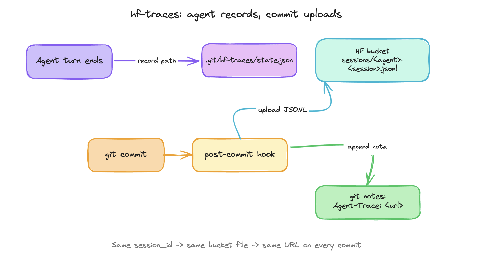

# hf-traces

`hf-traces` is a small Hugging Face CLI extension for saving agent traces to a private HF bucket and leaving a Git note on the next commit.

```sh
hf extensions install cfahlgren1/hf-traces
hf traces setup --bucket <namespace>/agent-traces --agents codex,claude
```

After setup, the upload is driven by `git commit`. Agent hooks only record where the session JSONL lives; the post-commit hook uploads it to the bucket, attaches the trace URL as a git note, and schedules a short refresh so the trailing JSONL written after the commit still lands in the bucket:



The bucket stores only the raw trace JSONL. The repository stores only a small pointer like:

```txt
Agent-Trace: https://huggingface.co/buckets/<namespace>/agent-traces/tree/<repo>/<branch>/sessions/<agent>-<session>.jsonl
```

## Sessions and commits

Traces are keyed by agent `session_id`, not by commit. All commits made during
the same Claude or Codex session share one trace URL, and the JSONL on HF is
overwritten in place as the session grows. A new session produces a new URL.

Each Git worktree has its own state file (under that worktree's `.git`
directory) and usually its own branch, so worktrees get independent traces.

## Commands

```sh
hf traces setup --bucket cfahlgren1/agent-traces --agents codex,claude
hf traces status
hf traces latest
hf traces doctor
```

Internal hook commands are installed by `setup`:

```sh
hf traces hook codex record
hf traces hook codex stop
hf traces hook claude record
hf traces hook claude stop
hf traces hook git post-commit
```

## Git notes

Trace links are written to `refs/notes/hf-traces`.

Git notes are local refs. They do not travel with a normal branch push unless you explicitly push or fetch the notes ref. This extension does not push notes automatically.

```sh
git notes --ref=hf-traces show HEAD
git log --show-notes=hf-traces
```

## Buckets

Create the bucket before the first upload:

```sh
hf buckets create <namespace>/agent-traces --private --exist-ok
```

The upload path is:

```txt
hf://buckets/<namespace>/agent-traces/<repo>/<branch>/sessions/<agent>-<session>.jsonl
```
